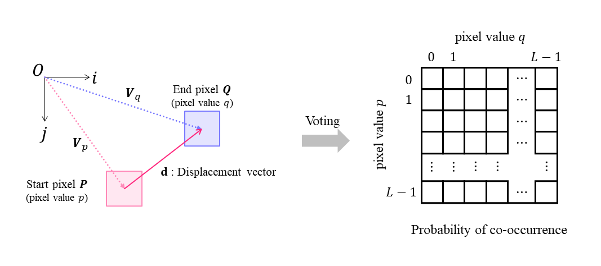

# Image co-occurrence probability

A co-occurrence histogram is the frequency of occurrence of a pair of pixel values $p$ and $q$ for each of two pixels $P$ and $Q$ in an image, over the entire image. A co-occurrence histogram can be created by arranging the pixel values $P$ and $Q$ in a two-dimensional matrix. The definition of the co-occurrence histogram is shown in Equation \ref{eq:hist}. where $\bm{V}_p$ and $\bm{V}_q$ are the position vectors of pixels $P$ and $Q$, and $\bm{d}$ is the displacement vector from pixel $P$ to $Q$.
